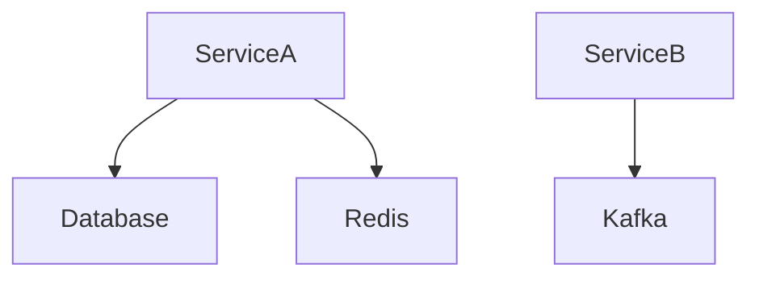

# System Architecture

Last Updated: {{timestamp}}
Overall Confidence: {{confidence_score}}

---

## 📝 System Overview (Human Editable)

Describe:
 - The purpose of the system
 - Core domain boundaries
 - High-level responsibilities
 - Design philosophy (monolith vs microservices, event-driven, etc.)
 - Key architectural constraints

This section is never auto-modified.

---

## 🔄 AUTO-GENERATED: Service Inventory
<!-- BEGIN_AUTO_SERVICES -->

| Service Name | Path | Type | Entrypoint | Confidence |
|--------------|------|------|------------|------------|

<!-- END_AUTO_SERVICES -->

---

## 🔄 AUTO-GENERATED: Service Responsibilities
<!-- BEGIN_AUTO_RESPONSIBILITIES -->
service-name

 - Responsibility 1
 - Responsibility 2
 - External integrations

<!-- END_AUTO_RESPONSIBILITIES -->

---

## 🔄 AUTO-GENERATED: Service Dependencies
<!-- BEGIN_AUTO_INTERNAL_DEPENDENCIES -->

Service A → PostgreSQL  
Service A → Redis  
Service B → Kafka  

<!-- END_AUTO_INTERNAL_DEPENDENCIES -->

---

## 🔄 AUTO-GENERATED: External Dependencies
<!-- BEGIN_AUTO_EXTERNAL_DEPENDENCIES -->

| Service | Depends On | Type | Notes |
|---------|------------|------|-------|

<!-- END_AUTO_EXTERNAL_DEPENDENCIES -->

---

## 🔄 AUTO-GENERATED: Data Stores
<!-- BEGIN_AUTO_DATA_STORES -->

| Store Type | Name | Used By | Confidence |
|------------|------|---------|------------|

<!-- END_AUTO_DATA_STORES -->

---

## 🔄 AUTO-GENERATED: Messaging / Event Systems
<!-- BEGIN_AUTO_MESSAGING -->

| System | Producer | Consumer | Topic / Queue |
|--------|----------|----------|---------------|

<!-- END_AUTO_MESSAGING -->

---

## 🔄 AUTO-GENERATED: Architecture Diagram
<!-- BEGIN_AUTO_DIAGRAM -->

<!-- END_AUTO_DIAGRAM -->

---

<!-- BEGIN_AUTO_CHANGE_SUMMARY -->

Summary of architectural impact detected based on latest change.
Example:
 - New service added: reporting-service
 - Database dependency modified
 - No breaking service boundary changes detected

<!-- END_AUTO_CHANGE_SUMMARY -->
