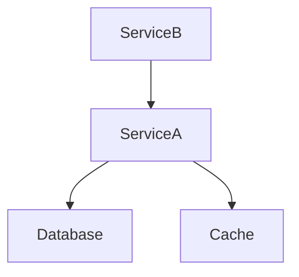

# Deployment Architecture

Last Updated: {{timestamp}}
Overall Confidence: {{confidence_score}}

---

## 📝 Deployment Strategy (Human Editable)

Describe:

- Target environments (dev, staging, prod)
- Deployment model (containerized, VM-based, serverless, hybrid)
- CI/CD pipeline overview
- Release strategy (rolling, blue/green, canary, etc.)
- Rollback philosophy
- Operational constraints

This section is never auto-modified.

---

## 🔄 AUTO-GENERATED: Environment Overview
<!-- BEGIN_AUTO_ENVIRONMENT_OVERVIEW -->

| Environment | Infrastructure Type | Region / Cluster | Notes | Confidence |
|-------------|--------------------|------------------|-------|------------|

<!-- END_AUTO_ENVIRONMENT_OVERVIEW -->

---

## 🔄 AUTO-GENERATED: Deployment Units
<!-- BEGIN_AUTO_DEPLOYMENT_UNITS -->

| Unit Name | Type (Service/Worker/Job) | Build Source | Runtime | Confidence |
|-----------|---------------------------|--------------|---------|------------|

<!-- END_AUTO_DEPLOYMENT_UNITS -->

---

## 🔄 AUTO-GENERATED: Infrastructure Components
<!-- BEGIN_AUTO_INFRA_COMPONENTS -->

| Component | Type (Container/VM/Pod/Lambda/etc.) | Managed By | Notes | Confidence |
|-----------|---------------------------------------|------------|-------|------------|

<!-- END_AUTO_INFRA_COMPONENTS -->

---

## 🔄 AUTO-GENERATED: Service Exposure
<!-- BEGIN_AUTO_SERVICE_EXPOSURE -->

| Service | Exposure Type (Internal/Public) | Port / Route | Gateway / Proxy | Confidence |
|---------|----------------------------------|--------------|-----------------|------------|

<!-- END_AUTO_SERVICE_EXPOSURE -->

---

## 🔄 AUTO-GENERATED: Build & CI/CD Pipeline
<!-- BEGIN_AUTO_CICD_PIPELINE -->

| Stage | Tool / System | Trigger | Artifact Produced | Confidence |
|-------|---------------|--------|-------------------|------------|

<!-- END_AUTO_CICD_PIPELINE -->

---

## 🔄 AUTO-GENERATED: Configuration & Secrets Management
<!-- BEGIN_AUTO_CONFIG_MANAGEMENT -->

| Configuration Type | Source (Env/File/Secret Manager) | Used By | Confidence |
|--------------------|-----------------------------------|---------|------------|

<!-- END_AUTO_CONFIG_MANAGEMENT -->

---

## 🔄 AUTO-GENERATED: Runtime Dependencies
<!-- BEGIN_AUTO_RUNTIME_DEPENDENCIES -->

| Service | Depends On | Type (DB/Cache/Queue/API) | Confidence |
|---------|------------|----------------------------|------------|

<!-- END_AUTO_RUNTIME_DEPENDENCIES -->

---

## 🔄 AUTO-GENERATED: Deployment Dependency Graph
<!-- BEGIN_AUTO_DEP_GRAPH -->

<!-- END_AUTO_DEP_GRAPH -->

---

## 🔄 AUTO-GENERATED: Scaling & Resilience Model
<!-- BEGIN_AUTO_SCALING_MODEL -->

| Component | Scaling Strategy | Health Checks | Restart Policy | Confidence |
|-----------|------------------|---------------|----------------|------------|

<!-- END_AUTO_SCALING_MODEL -->

---

## 🔄 AUTO-GENERATED: Observability & Monitoring
<!-- BEGIN_AUTO_OBSERVABILITY -->

| Component	| Logging | Metrics | Tracing | Alerting | Confidence |
|-----------|---------|---------|---------|----------|------------|

<!-- END_AUTO_OBSERVABILITY -->

---

## 🔄 AUTO-GENERATED: Risk Assessment
<!-- BEGIN_AUTO_RISK -->

No destructive changes detected.

<!-- END_AUTO_RISK -->

---

## 🔄 AUTO-GENERATED: Rollback Strategy
<!-- BEGIN_AUTO_ROLLBACK -->

Describe observable rollback mechanism (if detectable).

<!-- END_AUTO_ROLLBACK -->

---

## 🔄 AUTO-GENERATED: Deployment Drift Detection
<!-- BEGIN_AUTO_DEPLOYMENT_DRIFT -->

- No undocumented infrastructure detected.
- No missing deployment units.
- Configuration mismatches: 0

<!-- END_AUTO_DEPLOYMENT_DRIFT -->

---